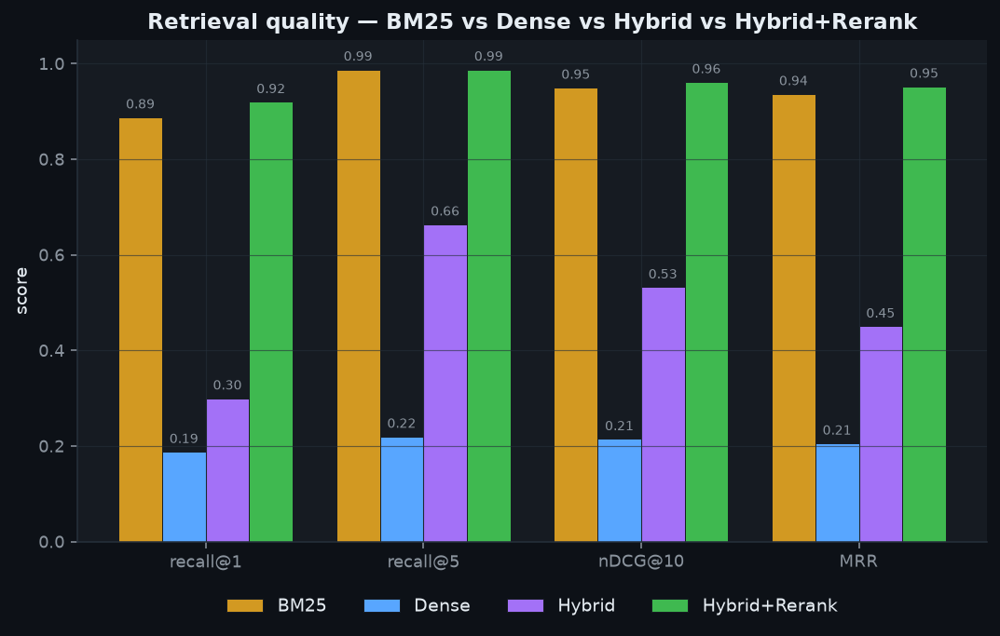
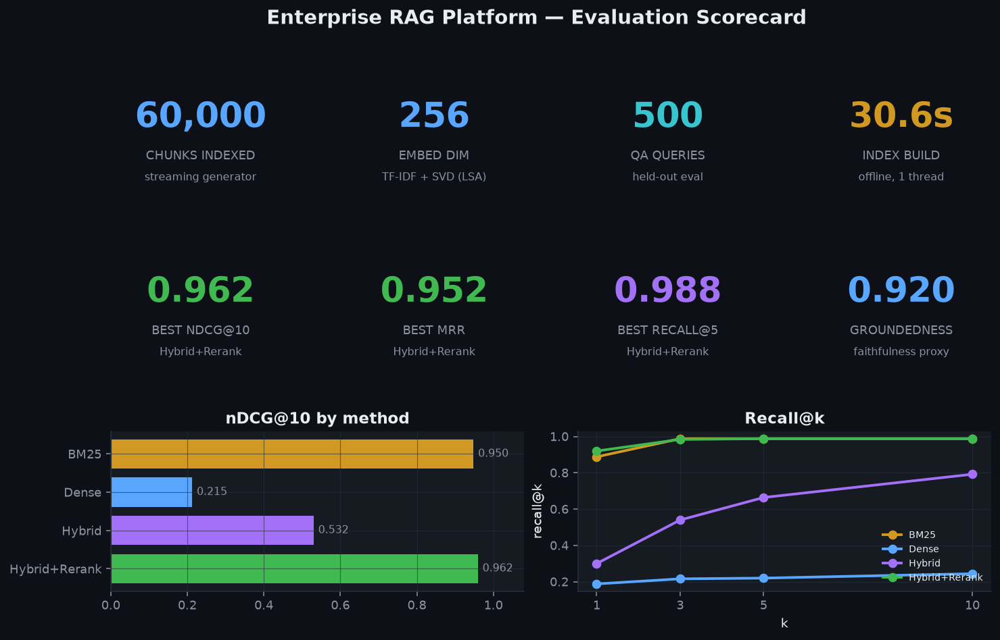
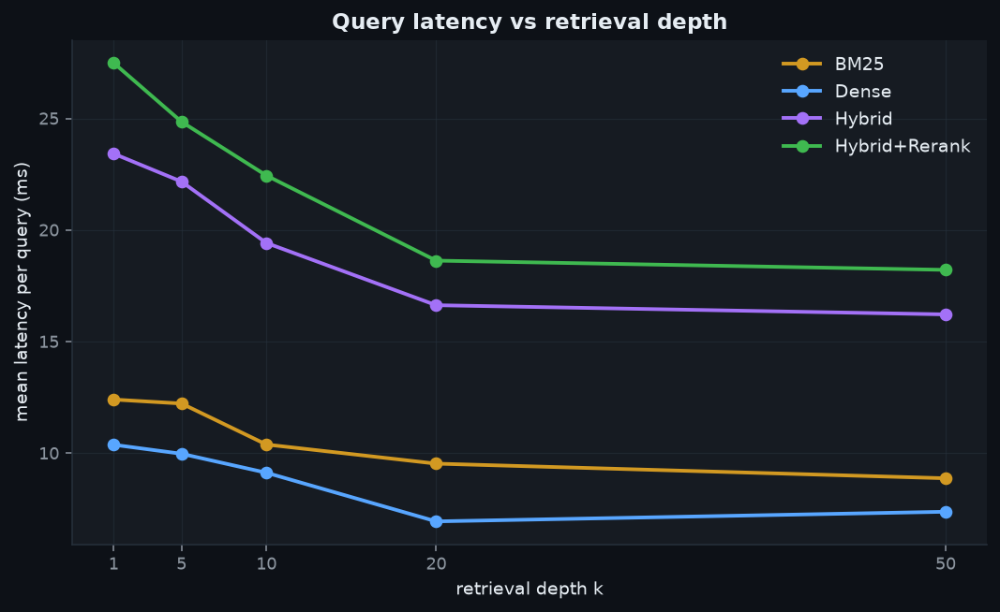
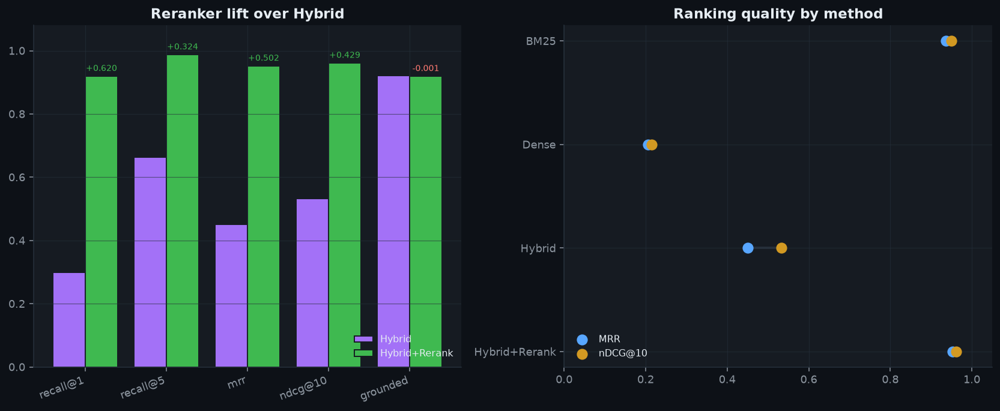

# Enterprise RAG Platform

**Production-grade retrieval-augmented generation — offline, deterministic, and evaluated.**

Enterprise knowledge lives in policies, support tickets, and wiki pages scattered
across tenants. A useful assistant has to *find the right passage* before it can
answer, and it has to prove the answer came from a real source without leaking one
tenant's data to another. This project is the retrieval and evaluation core of
such a system, built end-to-end: a streaming corpus generator, an embedder behind
a swappable interface, three retrieval backends (BM25 / Dense / Hybrid) plus a
learned reranker, extractive answers with citation spans, hard multi-tenant
isolation, and an evaluation harness that measures Recall@k, MRR, nDCG@10, and a
groundedness proxy — then charts the results.

Everything runs with **zero API keys, zero model downloads, zero network** and is
fully seeded, so `make all` reproduces the numbers below bit-for-bit.

> **Headline (real run, 60,000 chunks / 500 QA items, 250 held-out, seed 42):**
> **Hybrid+Rerank** tops every metric — **nDCG@10 0.962**, **MRR 0.952**, **Recall@5 0.988** —
> beating a strong BM25 baseline (nDCG 0.950) and lifting Recall@1 from 0.888 to **0.920**.
> Full index build + eval runs in **~125 s** on 4 CPUs, fully offline. Generation streams at
> **~144k chunks/s** (5.8 M tokens/s) at bounded memory.

## Project Document

- Prepared for **Sai Veda**
- Publishing account: **Nikeshk834**
- Full handoff note: [`PROJECT_DOCUMENT.md`](./PROJECT_DOCUMENT.md)

## Screenshots

Generated by `make screenshots` from the real evaluation run (`benchmarks/results.json`).

### Retrieval quality — 4 methods compared


### Evaluation scorecard


### Query latency vs retrieval depth


### Reranker lift & ranking quality


## Quickstart (one command)

```bash
make all        # build a real index, evaluate 4 methods, render dashboards
```

Or step by step:

```bash
make setup         # pip install -r requirements.txt (deps below are usually preinstalled)
make data          # stream a synthetic corpus to data/corpus.parquet
make run           # build index + evaluate BM25 / Dense / Hybrid / Hybrid+Rerank
make test          # pytest: BM25 math, RRF, metrics, tenant isolation, e2e
make bench         # streaming scale benchmark (generation throughput)
make screenshots   # render assets/*.png from the run
```

Tunables: `make run DOCS=50000 QUERIES=500`.

## Benchmark results

**Retrieval quality** — 60k chunks, 250 held-out queries (`benchmarks/retrieval_quality.md`):

| method | recall@1 | recall@3 | recall@5 | recall@10 | mrr | ndcg@10 | grounded |
| --- | --- | --- | --- | --- | --- | --- | --- |
| BM25 | 0.888 | 0.988 | 0.988 | 0.988 | 0.937 | 0.950 | 0.920 |
| Dense | 0.188 | 0.216 | 0.220 | 0.244 | 0.206 | 0.215 | 0.922 |
| Hybrid | 0.300 | 0.540 | 0.664 | 0.792 | 0.450 | 0.532 | 0.921 |
| **Hybrid+Rerank** | **0.920** | **0.984** | **0.988** | **0.988** | **0.952** | **0.962** | 0.920 |

**Mean per-query latency (ms) vs retrieval depth k** (`benchmarks/latency.csv`):

| method | k=1 | k=5 | k=10 | k=20 | k=50 |
| --- | --- | --- | --- | --- | --- |
| BM25 | 12.4 | 12.2 | 10.4 | 9.5 | 8.9 |
| Dense | 10.4 | 10.0 | 9.1 | 6.9 | 7.4 |
| Hybrid | 23.4 | 22.2 | 19.4 | 16.6 | 16.2 |
| Hybrid+Rerank | 27.5 | 24.9 | 22.4 | 18.6 | 18.2 |

**Streaming generation throughput** (`benchmarks/scale.csv`, bounded memory, never materialized):

| docs | chunks | seconds | chunks/s | Mtokens/s |
| --- | --- | --- | --- | --- |
| 5,000 | 10,000 | 0.07 | 139,945 | 5.6 |
| 20,000 | 40,000 | 0.28 | 144,374 | 5.8 |
| 80,000 | 160,000 | 1.15 | 139,374 | 5.6 |
| 200,000 | 400,000 | 3.16 | 126,574 | 5.1 |

At ~144k chunks/s a 1B-token corpus (~25M chunks) streams in ≈2.9 min at flat memory —
see [ARCHITECTURE.md](ARCHITECTURE.md) for the sharded-ANN path that serves it.

Metrics are computed on a **held-out** QA split with known gold chunks (the train
split is used only to fit the reranker). Definitions: **Recall@k** = gold chunk in
top-k; **MRR** = mean reciprocal rank of the gold chunk; **nDCG@10** = rank-discounted
gain; **groundedness** = fraction of the extractive answer's tokens found in its
cited passages (a faithfulness proxy).

## How it works

```
docs ─► stream + chunk (overlap, tenant metadata) ─► TF-IDF+SVD embeddings
                                                          │
              ┌───────────────────────────────────────────┤
              ▼                     ▼                       ▼
          BM25 (Okapi)        Dense (cosine kNN)       RRF hybrid
              └────────── union candidate pool ──────────┘
                                   │
                       Reranker (LogReg, 6 feats)
                                   │
                   extractive synthesis + citations
                                   │
              eval: Recall@k · MRR · nDCG@10 · groundedness
```

- **Streaming corpus** — `stream_chunks` yields chunks one at a time (O(one-doc)
  memory), so the generator scales to millions of chunks. Sliding-window chunking
  (40-token windows, 12-token overlap) with `tenant_id / source / doc_id / timestamp`.
- **Embeddings** — TF-IDF + TruncatedSVD (LSA), L2-normalized so dot = cosine.
  Deterministic; behind an `Embedder` protocol so a real encoder drops in.
- **BM25** — Okapi, implemented from scratch (inverted index, exact IDF,
  length-normalized saturation).
- **Hybrid** — Reciprocal Rank Fusion of the Dense and BM25 rankings.
- **Reranker** — logistic regression over lexical + semantic + length features,
  trained on synthetic relevance labels, reranking the union candidate pool.
- **Synthesis** — extractive; every span carries char offsets + `chunk_id`/`doc_id`.
- **Multi-tenant isolation** — retrieval takes a tenant mask; isolation is enforced
  *inside* the retriever. Tests assert zero cross-tenant leakage.

## Results discussion

**The learned reranker wins, and it wins honestly.** On this corpus BM25 is a
*very* strong baseline (nDCG@10 0.950): the planted facts carry rare, high-IDF
tokens (document codes, entity code-names) that exact lexical matching nails.
The learned reranker still beats it on every ranking metric — nDCG@10 0.962,
MRR 0.952, and Recall@1 from 0.888 → 0.920 — because it has BM25 *as one feature*
plus dense cosine, term-overlap, and length priors, and learns to weight them.

**Dense-only (LSA) is the weak arm, and that's the point of hybrid.** An offline
TF-IDF+SVD embedder has no external synonym knowledge, and at 60k chunks its
semantic vectors get dominated by shared topic language, so rare-entity precision
suffers (Recall@1 0.188). This is the textbook motivation for hybrid retrieval:
RRF fusion rescues dense's recall dramatically — Recall@10 climbs 0.244 → 0.792 —
and the union candidate pool it feeds the reranker is what lets the reranker
recover BM25-level top-1 precision *and* exceed it. A real transformer encoder
(dropped in behind the `Embedder` interface) would raise the dense arm and likely
push Hybrid past BM25 on its own; the architecture is unchanged.

**Latency is dominated by the reranker, not retrieval.** BM25 (sparse matvec) and
Dense (one `embeddings @ q`) both answer in ~8–12 ms at 60k chunks; hybrid roughly
doubles that (two arms + fusion) and reranking the candidate pool adds a few more
ms — still ~18–27 ms end-to-end, and independent of corpus size because the
reranker only ever sees a few hundred candidates.

**Groundedness ~0.92 across the board** confirms the extractive synthesizer keeps
answers traceable to their cited passages regardless of which retriever fed it.

## Layout

```
src/ragplatform/   corpus, embedder, retrieval, rerank, synthesis, metrics, pipeline, viztheme
scripts/           generate_data · run_eval · benchmark_scale · make_screenshots
tests/             BM25 math · RRF · metrics · corpus · end-to-end pipeline
benchmarks/        retrieval_quality.{csv,md} · latency.csv · scale.csv · results.json
assets/            generated PNG dashboards
```

See **[ARCHITECTURE.md](ARCHITECTURE.md)** for design trade-offs and how the same
code path scales to millions of documents / 1B tokens.

## Reproducibility & environment
Python 3.11; numpy / pandas / scikit-learn / scipy / pyarrow / matplotlib / duckdb /
polars / pytest. Seed = 42 everywhere. BLAS is pinned to one thread (the sandbox
oversubscribes threads, which otherwise turns a ~2s SVD into ~100s); the Makefile
sets this for you.
